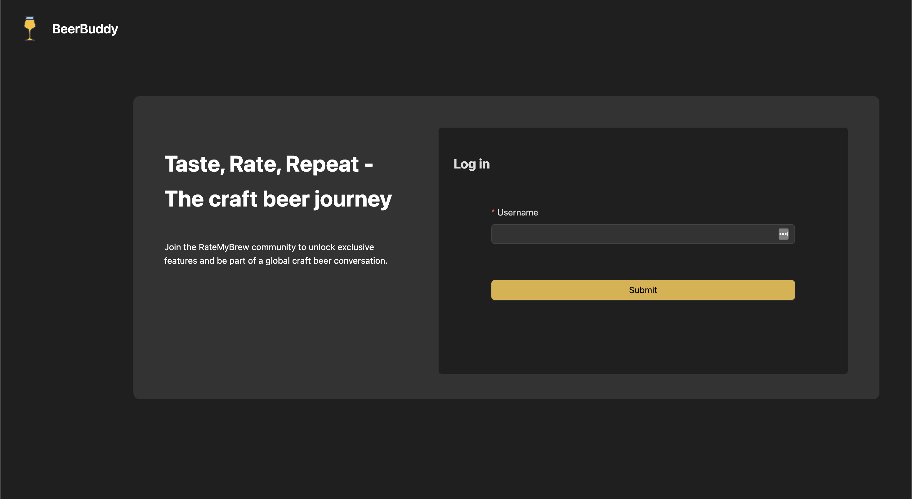
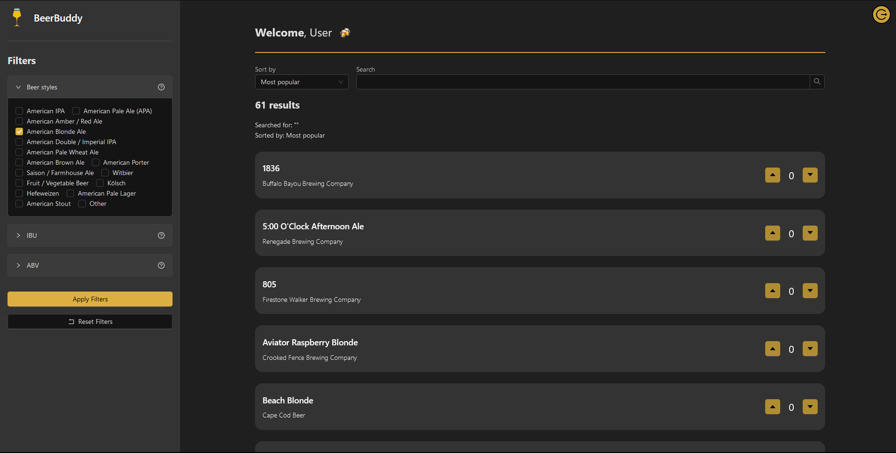
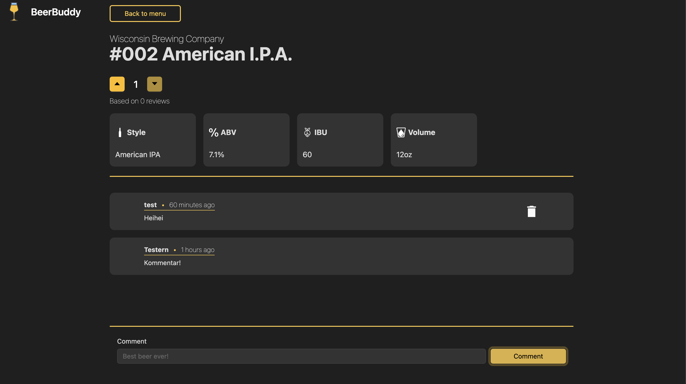

# About the project

BeerBuddy is a website where you can find and review beers. The website displays craft beers from the US, and uses a dataset [from Kaggle](https://www.kaggle.com/datasets/nickhould/craft-cans/data). The website is made with a frontend in React and a backend in GraphQL. The backend uses a SQLite database.

## How to use the website

If you are using NTNU network or are connected to its VPN you can access the website [here](https://it2810-15.idi.ntnu.no/project2). If not, you can run the project locally.

To be able to use the website you must first register to the website. The first time you visit the website you will be prompted to the login page. You only need to register your name, and then a unique ID is generated automatically. Your user will be saved in the database, as well as the localstorage. The userdata is put in localstorage as to ensure that the user is logged in when navigating the page. This will then be used to identify you and your actions.

When you have logged in you will be able to see the main page. Here you will see a list of beers. You can vote on a beer by clicking the arrow up or down. 

Here you can search for beers, alter filters to be able to find just the type of beer you're after and sort the beers by popularity or name.

When you click on a beer you are able to see more information about it. Here you may find information about the brewery, and some detailed information about it's alcohol percentage and IBU. You are also to be able to vote it up or down, and you're able to comment. You can also see other people's comments and delete your own comments.

# Run the project

## Set up backend and database

To set up the backend and database, please go to the [backend documentation](./backend/README.md).

## Set up frontend

To set up the frontend, please go to the [frontend documentation](./frontend/README.md).

# Libraries, frameworks and tech stack

## Frontend

- [React with Typescript](https://react.dev) - Framework and library for building the user interface, using Typescript for type safety
- [Eslint](https://eslint.org) - A linter for identifying and reporting on patterns in Typescript
- [Material UI](https://mui.com) - A React UI framework for building responsive and accessible websites
- [Antd](https://ant.design) - A React UI library for building responsive and accessible websites
- [Vitest](https://vitest.dev/) - A test runner for React applications
- [Playwright](https://playwright.dev) - A library for testing web applications
- [React infinite scroll](https://www.npmjs.com/package/react-infinite-scroll-component) A library for infinite scrolling
- [Uuid](https://www.npmjs.com/package/uuid) A library for generating unique IDs

## Backend
- [Express](https://expressjs.com) - A server framework for node js.
- [Typescript](https://www.typescriptlang.org) - A typed superset of JavaScript that compiles to plain JavaScript.
- [Graphql & express-graphql](https://graphql.org) - A query language for APIs and a server for running queries.
- [SQLite](https://www.sqlite.org/index.html) - A relational database for storing data
- [Sequelize](https://sequelize.org) - A promise-based Node.js ORM for Postgres, MySQL, MariaDB, SQLite and Microsoft SQL Server.
- [Node-cache & Crypto](https://www.npmjs.com/package/node-cache) - A library for caching data and hashing data

# Choices

## Frontend

We used Vitest together with React, Typescript and ES lint as it was a requirement for the course. But it is also a good choice for testing React applications. It is easy to set up and use, and it is fast. It also has a good documentation. 

We used Antd and Material UI for styling. We used Antd for most of the components, and used MUI where the components from Antd did not fit our needs.

Playwright was used for testing the end to end functionality of the website. It is a good choice for testing web applications, and it is easy to use. It is also fast and has a good documentation.

And lastly React infinite scroll and Uuid was used for infinite scrolling and generating unique IDs.

## Backend

We used express and typescript as a server framework for node js. It is a good choice for building a server and many of us had experience with it from before. It is also easy to use and has a good documentation. 

The other libraries we have we explained more on why we used in [sustainability documentation](./sustainability.md).

# Run tests

## Run frontend tests

To test the frontend, please go to the [frontend documentation](./frontend/README.md).

## Backend testing

The backend and API are implicitly tested through the frontend tests. To run the frontend tests, please go to the [frontend documentation](./frontend/README.md).

# Sustainability

If you want to learn about the measures taken to ensure a sustainable application, please go to the [sustainability documentation](./sustainability.md).

# Accessibility

If you want to learn about how we have ensured that our website is accessible to as many as possible, please go to the [accessibility documentation](./accessibility.md).

# Requirements
If you want to learn about how we have fulfilled the requirements for the project, please go to the [requirements documentation](./requirements.md).

# Contribution

This project was developed as a part of the course IT2810 - Web Development at NTNU during the autumn of 2023.

The project is developed by a group of four students and we have used the following conventions for contribution: [Contribution](./contribution.md)

The contributors are:

- Sondre Alfnes
- Erik Menkin Lysfjord
- Frederik Andreas Brunvoll Farstad
- Markus Aleksander Råkil Johansen

