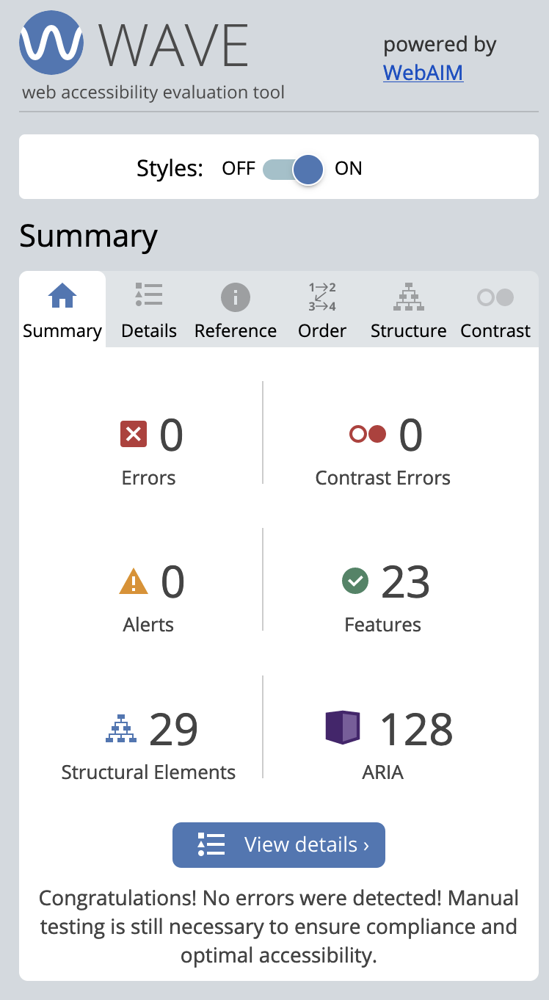
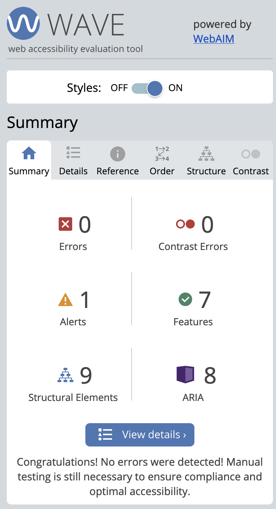
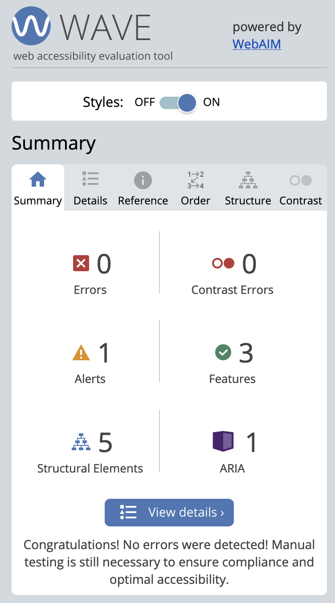
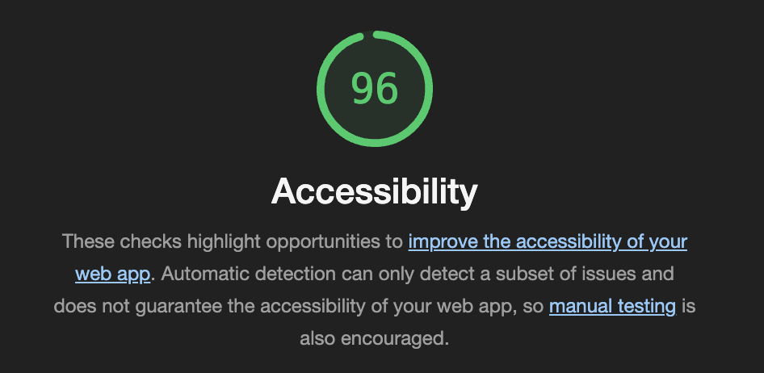
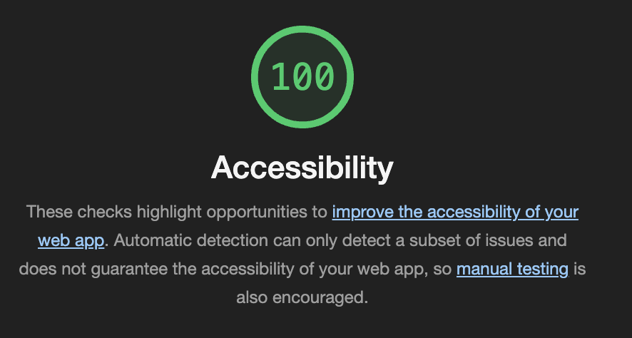
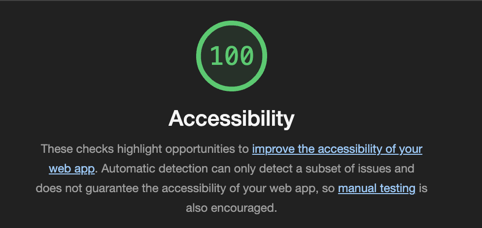

# Accessibility measures for the application

This document describes the accessibility measures that were taken to make the application more accessible. Into two different categories: UX-Design and Screen reader support. We have also included a section discussing different technologies we have used to measure the accessibility of our application. Each category is described in a separate section, and the different measures are described in detail in each section.

## Table of contents

- [UX-Design](#ux-design)
  - [Color scheme](#color-scheme)
  - [Font](#font)
  - [Reduced information density](#reduced-information-density)
  - [Focus indicators](#focus-indicators)
  - [Section headings](#section-headings)
  - [Tooltips](#tooltips)
  - [User feedback on actions](#user-feedback-on-actions)
  - [Labelling of interactive elements](#labelling-of-interactive-elements)
  - [Ant-design components](#ant-design-components)
  - [Material UI components](#material-ui-components)
  - [Responsive design](#responsive-design)
- [Screen reader support](#screen-reader-support)
  - [Keyboard navigation](#keyboard-navigation)
  - [HTML semantics](#html-semantics)
  - [ARIA attributes](#aria-attributes)
  - [Skip to content](#skip-to-content)
  - [Screen readers and infinite scroll](#screen-readers-and-infinite-scroll)
- [Technologies used to measure accessibility](#technologies-used-to-measure-accessibility)
  - [Firefox Accessibility](#firefox-accessibility)
  - [WAVE](#wave)
  - [aXe](#axe)
  - [Lighthouse](#lighthouse)
  - [Screen readers](#screen-readers)

---

## UX-Design

The design of the application was made with accessibility in mind, to make it as easy as possible for people with disabilities to use the application. Design choices that reinforce this, will also lead to a better user experience for everyone. The design choices that were made to make the application more accessible are listed below, and are explained in more detail in the following sections:

### Color scheme

The color scheme of the application was chosen to be as accessible as possible. The colors were chosen to have a high contrast, and to be distinguishable from each other. We wanted to use a color scheme that was not too bright, to make it easier to use the application in a dark environment, which is why we use a dark theme with yellow highlights for the application. The yellow colors catches the eye, and is used for action buttons and other elements that the user should be able to find easily. The dark theme is also easier on the eyes, and makes it easier to focus on the content of the application.

### Font

The font used in the application is `Inter` by Rasmus Andersson. This font was chosen because it is a very readable font, and it is also very accessible. The font is available in many different weights, which makes it possible to use different weights to emphasize different parts of the application. The design heavily relies on the font weight and size to make the application more accessible and easier to use.

### Reduced information density

The application is designed to have a low information density. This means that there is not a lot of information on the screen at the same time. This makes it easier to focus on the information that is on the screen, and it makes it easier to navigate the application. The application is designed to have a lot of whitespace, which makes it easier to read the information on the screen.

### Focus indicators

The application has focus indicators for all interactive elements. This makes it easier to navigate the application using the keyboard, and it makes it easier to see what element is currently focused. The focus indicators are also used to show which element is currently selected in a list, and to show which element is currently being dragged.

### Section headings

The application uses section headings to divide the content of the application into different sections. This makes it easier to navigate the application, and it makes it easier to find the information that you are looking for. The section headings are also used to make the application more accessible for screen readers.

### Tooltips

For the filters in the application, we use tooltips to explain what the different filters do. This makes it easier to understand what the filters do, and it makes it easier to use the filters. The tooltips are also used to make the application more accessible for screen readers.

### User feedback on actions

The application gives the user feedback when they perform an action through ant-design's message components. This component is a popup message that clearly indicates wether the action was a success or an error. This makes it easier to understand what happened when you perform an action.

### Labelling of interactive elements

Interactive elements in the application are clearly labelled. This makes it easier to understand what the different elements do, and it makes it easier to use the application. Select buttons and textfield are examples of labeled components.

### Ant-design components

The application uses ant-design components for most of the interactive elements. These components are designed to be accessible, and is a commonly used library for user-friendly components.

### Material UI components

When we used Ant Design components, we found that the Slider component was not very accessible. This was highlighted by Firefox Accessibility, WAVE and aXe. We therefore switched this component out for the Slider-component from MUI.

### Responsive design

The application is designed to be responsive, and to work on different screen sizes.

---

## Screen reader support

Screen readers are used by people with visual impairments to navigate the web. This is our measures to make the application more accessible for screen readers:

### Keyboard navigation

The application can be navigated using the keyboard. This makes it possible to use the application without a mouse, which is important for people with visual impairments. The application can be navigated using the `Tab` key, and the `Enter` key is used to select an element. The `Esc` key is used to exit the infinite scroll, and to close modals and popups.

### HTML semantics

HTML are important for accessibility because it provides semantic information about the content of the application. This makes it easier for screen readers to understand the content of the application, and it makes it easier to navigate the application using the keyboard. The application uses semantic HTML, and HTML5 tags like `<main>`, `<header>`, `<nav>`, `<section>`

### ARIA attributes

ARIA attributes like `aria-label` are used to make the application more accessible for screen readers. These attributes are used to provide additional information about the content of the application, and to make it easier to navigate the application using the keyboard. The application uses ARIA attributes for all interactive elements, and for all elements that are not self-explanatory.

### Skip to content

The application has a "skip to content" link that makes it possible to skip the navigation and go directly to the content of the application. This makes it easier to navigate the application using the keyboard.

We have only implemented it on the home page, as we felt the Beer-page was not complex enough to warrant it.

### Screen readers and infinite scroll

The application uses infinite scroll to load more data when the user scrolls to the bottom of the page. To exit the infinite scroll with keyboard navigation, the user can press the `Esc` key. This will exit the infinite scroll, and the user can continue to navigate the application using the keyboard.

---

## Technologies used to measure accessibility

We have used different technologies to measure the accessibility of our application. These technologies are described below:

### Firefox Accessibility

Firefox Accessibility is a tool that is built into Firefox. It is used to measure the accessibility of the application, and it is used to find accessibility issues. We have used this technology a lot in the development of the website. Link to the tool: https://developer.mozilla.org/en-US/docs/Tools/Accessibility_inspector

### WAVE

WAVE is an extension that is used to detect accessibility issues in the application. It is used to find issues with the HTML semantics, contrast issues, keyboard navigation and so on. We have used this thoroughly to find issues with the application. Link to the extension: https://wave.webaim.org/extension/

Using WAVE we have discovered that the main page has no errors, warnings, or contrast issues. The beer page has one warning on desktop, as it finds the "go back"-button redundant. We have chosen to keep this button, as it communicates to the user that they can go back to the previous page. The log in page also has an alert, which we have chosen to ignore.

  
   
  

### aXe

jest-axe is a tool that is used to find accessibility issues in the application. It usually looks for the most common accessibility issues, which makes it useful for an extra layer of accessibility testing. We do not rely solely on this tool, but it is useful to find issues that we might have missed. Link to the tool: https://github.com/NickColley/jest-axe

### Lighthouse

Google Lighthouse is an automated tool used to improve the quality of web pages. It is used to measure the performance, accessibility, best practices and SEO of the application. It is used to find issues with the HTML semantics, contrast issues, keyboard navigation and so on. Link to the tool: https://developers.google.com/web/tools/lighthouse

Using Lighthouse, we found that the main page gets a score of 96 for accessibility, while the beer page and the log in page gets a score of 100 for accessibility. The reason we did not receive a score of 100 for the main page is because the BeerCard-components aria-label is not the same as the text in the card. We found that this was not an issue, as the aria-label only displays the name of the beer, which we find is the most important aspect of the beer card.

  
   
  

### Screen readers

We have used screen readers to test the accessibility of the application. We have used the screen readers NVDA and VoiceOver. We have used the screen readers to test the keyboard navigation, and to test the HTML semantics and ARIA attributes.
