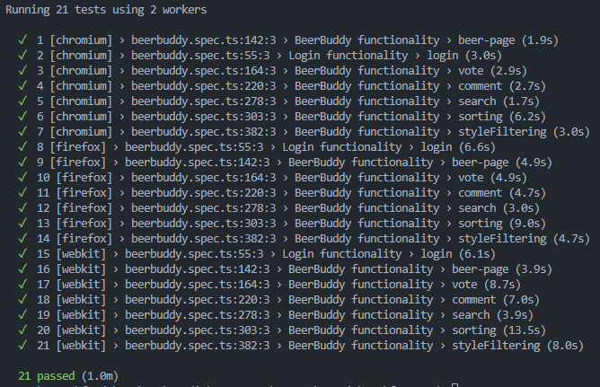

# Frontend

## Run frontend

Make sure you have node installed on your machine. Then run the following command in the root of the project:

- cd frontend
- npm install
- npm run dev
  The frontend should now be running on localhost:3000.

## Run all frontend tests

**NB: REQUIRES CONNECTION TO NTNU VPN TO WORK**

(End-to-end tests may fail for various reasons as described in the [run end-to-end tests](#run-end-to-end-tests) section. See that section for more information on how to ensure that the tests pass in case of failure.)

To run all the frontend tests, run the following commands in the root of the project:

```bash
cd frontend
npm install
npx playwright install
npm run test
```

If you want to then view the test coverage, you can run the following command:

```bash
npm run coverage
```

There will then be displayed information about the test coverage is the terminal. There will also be generated HTML pages in the `coverage`-folder. You can then open the `index.html`-file in your browser to view the test coverage in a more user-friendly way.

## Run only frontend unit-tests

To run only the frontend unit-tests, run the following commands in the root of the project:

```bash
cd frontend
npm install
npm run test:vitest
```

If you want to then view the test coverage, you can run the following command:

```bash
npm run coverage
```

## Run only end-to-end tests

**NB: REQUIRES CONNECTION TO NTNU VPN TO WORK**

Keep in mind that this test takes ~1.5 minutes to complete. This is due to the fact that the tests are run and simulated through a browser, and that the browser needs to wait for the backend to respond to the requests.

To run the end-to-end tests, run the following command in the root of the project:

```bash
cd frontend
npm ci
npx playwright install
npm run test:e2e
```

You can also run an instance of the tests for chromium in a HEADED-mode (~1 minute). This means that you can see the browser window while the tests are running, giving you insight into what is happening in the tests.
You can run the chromium tests in HEADED-mode using the following command:

```bash
npm run test:headed
```

The tests can also be run in parallel to speed up the testing (~1 minute), however, this is **not recommended** as the VM the backend is hosted on may not always be able to handle the load of multiple simultaneous requests.
To run the tests in parallel, run the following command:

```bash
npm run test:parallel
```

Keep in mind that the tests may fail just on the basis of the backend being slow to respond. If this happens, just run the tests again and they should pass. The tests rerun automatically up to 2 times if they fail, so this usually doesnt happen.

It may also be worth noting that if multiple people run the tests at the same time, they may interfere with each other and subsequently fail. This is due to the fact that the tests are not run in a sandboxed environment, but rather on the same database. If you quit a test run before it is finished, then the database may be left in an inconsistent state as the cleanup is not run. If this happens, just run the tests again and they should pass.

If you encounter any other problems running the tests, make sure [playwright](https://playwright.dev/docs/intro) is installed correctly before trying again.


